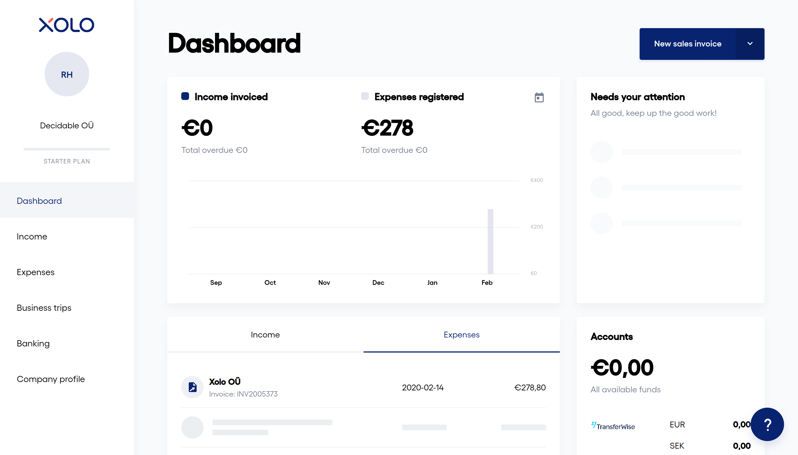

This will list my history with applying for an e-Residency in Estonia, and setting up and running a company with [Xolo](xolo.io).

# Costs
- **E-residency**: 100 euros
- **Xolo**
  * 79 euros/month (49 euros until first revenue), ex. VAT
  * 285 euros in "state fee" and first month of service

# History 

## October 22nd (Week 0): Setting up a Xolo account

Eeasy peasy.
Log on, describe your business as you would to any bank or accountant, and the onboarding begins.
First step is to get an e-Residency.

## October 22nd (Week 0): Applying for e-Residency

It is a simple web form.
You are asked some questions about your motivation and intended business activites, take photos of identitfication documents, submit photo of yourself (passport style) and pay 100 euros.

All following communications arrive by e-mail.

### October 30th (Week 1): "Your application for the e-Resident's digital ID has been accepted for processing"

> Dear <NAME>,
> 
> The Estonian Police and Border Guard Board has received an application for the e-Resident’s digital ID submitted by <NAME> born on <DATE>. The application number <NBR> has now been accepted for processing and you will be notified of the decision within 30 days. If the application is approved, your digital ID card and starter kit will then be sent to your chosen pick-up location.
> 
> We remind you to check your e-mails regularly as you might be asked for additional information or documents. Please also check your junk e-mail box.
> 
> For additional questions please see:
> 
>     https://e-resident.gov.ee/support/
>     https://e-resident.gov.ee/contacts/support/

### November 8th (Week 2): "e-Residency granted"

> Dear <NAME>,
> 
> The Estonian Police and Border Guard Board has granted e-Residency to NAME born on DATE, Estonian personal identification code CODE.
> 
> Your document is not ready to be picked up yet. You will be notified upon its arrival to the place of issue, your pick-up location, within the next 2-5 weeks.
> 
> Your e-Residency starter kit, which contains your digital ID card and USB card reader, will now be sent by diplomatic post to the pick-up location you marked on your application and you will be notified again by email when it is ready to collect.
> 
> If you do not collect your digital ID card within 6 months after it has arrived at the pick-up location, the Estonian Police and Border Guard Board has the right to destroy it.

## February 11th (Week 16): Pick up card

Picked up the card at the embassy in Stockholm.

### February 14th (Week 16): Install software and start setting up company

Made a Makefile for installing all the necessary dependencies on Arch Linux.
Logged into Xolo, registered my e-Residency on my account.
Signed a few documents---service agreement and company application---and waited.

### Detour: Signing with DigiDoc

The signing software (DigiDoc4) is delightful.
You download a `.bdoc` file, open it up, and can inspect documents and signatures.
Not just a PDF with some badly printed "signature" on it, but the actual certificates used.

### February 18th (Week 17): Company is officially registered, set up bank account, sign some agreements

I got an e-mail saying that *Decidable OÜ* is a registered company in Estonia.
So now I have incorporated!
On to set up a bank account, or something resembling it.

There are two options for setting up a bank account: either use TransferWise, or set up an Estonian bank account at LHV.
Since the second option requires a visit to Tallinn, I chose to do with TransferWise for now.
It is also a service I know and trust.
It also lets me receive USD directly, which is a nice feature.
The fee for converting between USD and EUR comes out at about 0.45 percent at the moment, and withdrawals to a bank account comes out to around 60 cents (iether EUR or USD cents, basically the same) per transfer.
I already have a TransferWise account, so I just had to create a new profile: a business profile.
I put in the details for my new company, and I'm waiting for some sort of approval, which will take a few days.
There is an option to get a MasterCard debit card, which I will absolutely get once I have moved to my new home address and know where to send it.

Next, I need to sign some data processing agreement that is pretty standard.
Sign and be done.

The  step is signing what is allegedly (it's in Estonian) an application to register with the Tax Agency's e-portal, and a power-of-attorney to Xolo for representing me in tax matters.
I may be a bit overzealous about signing things (I read contracts in full), so I want to see if this step is necessary and I e-mailed Xolo about it.
I won't be paying taxes in Estonia for the foreseeable future, which is why I'm curious as to why I would register with the tax office.
I am quite sure that I will want to sign, but I want to double check this.
My assumptions are that, since the company is Estonian, it is presumed that I will pay taxes in Estonia, and Xolo needs to make an application so that I will *not* pay taxes in Estonia.

I got a fast reply, slightly ambiguous, saying that it is the company that registers with the tax authority, not me---which is pretty obvious.
But I was also informed this is mandatory, so I will just go ahead with it for now, before any real amount of money is in play.
Asking for clarification on corporate tax by returning e-mail.

### Detour: get Smart-ID

I was alerted to the option of setting up Smart-ID when I saw it as a login option in Xolo.
Basically, it's a way to sign and log in via a mobile application without using the card.
That is very convenient, so I signed up.
Security tip: This is a good time to generate new PIN codes, which the app prompts you to do.
Don't reuse some old number you use for other stuff, get some new codes and store them in a password manager.

### February 19th (Week 17): Onboarding completed, Set up TransferWise integration, Some clarification on taxes

After all this, the Xolo page still redirected me to the onboarding page, which contained two more steps to set up the LHV bank account.
I e-mailed Xolo and said I went with TransferWise, and they finalized the onboarding.
With that, my onboarding process is complete and I get access to a dashboard for my company---the Xolo Leap product I've been setting up is complete!
Here is what the dashboard looks like:

Note that my setup costs for the company are already on the books, which is nice.

Next step was setting up TransferWise integration.
Basically, you set up 2-factor verification, either via SMS or the TransferWise mobile app.
Then you get a read-only API token for TransferWise which you put into Xolo.
I imagine it's easy even if you have no idea what an API token is, the steps are outlined very clearly.
Then Xolo sees your balances and your transfers, which is helpful for their bookkeeping.

I also got an e-mail from TransferWise where they asked a simple follow-up question about my business, which I could answer by just replying to the e-mail.
Pretty hassle-free.

Regarding taxes, I learned something I did not expect, but also is not a big deal: I will pay corporate tax on dividends in Estonia.
Taxes are only paid when dividends are paid out, not on yearly profit.
Here is the full reply (emphasis mine):

> Estonian companies do not pay corporate taxes on the received revenue, only when taking funds out from the company (e.g salary, dividends). If you own and run an Estonian company, Xolo assumes the company is an Estonian tax resident which does not have any foreign permanent establishment. If correct, please follow the principles below. If this is not correct (anymore**, Xolo cannot provide support for your company and you need to find an alternative service provider.
> 
> If you operate outside Estonia, the following taxes apply.
> 
>     If you don't take any money out from your company, you don't need to pay corporate income tax in Estonia. You can keep the earned money on your company's account indefinitely and you won't have to pay income tax on it. You only need to start paying the relevant taxes when you start taking money out of the company, meaning paying yourself a salary, taking out dividends etc.
>     If you receive a salary from your company, it is classified as an employee salary, and no personal income tax nor social tax are paid on the salary in Estonia. Whilst the salary payments are not declared in Estonia, they are not tax-free. You’re responsible for declaring and paying taxes in the country where you are a tax resident as an individual person and/or where you perform your duties. Please contact the local authorities in the country to learn about the relevant tax rules and the procedures for declaring and making the payments properly. Unfortunately we can't assist you with this yet. However, please be ready to provide tangible evidence about the actual tax declarations and payments in your location upon a request by Estonian tax authorities or Xolo.
>     If you receive dividends from your company, **the corporate income tax is paid in Estonia. The rate is 20%, calculated as 20/80 from the net payment you receive**. For example, if you receive €800 net as dividends, the corporate income tax of €200 has to be paid in Estonia. No personal income tax is added in Estonia. However, the personal income tax is likely to be declared and paid in the country where you are a tax resident. Please contact the local authorities in the country to learn about the income tax rules and the procedures for declaring dividends received and making the payments properly. Unfortunately, we can't assist you with this yet either. In the case of regular dividend payments (each year), different tax rules may be due.
> 
> The principles listed above are valid only if you spend most of your time/efforts on tasks which contribute directly to your company’s core business (deliver a service, build a software product, promote your service etc) while keeping the proportion of management/administrative tasks at a minimal level. If this assumption is not true i.e. you are mainly involved in management/administrative tasks in your company (e.g. having the core business functions fully outsourced), the % of salary paid for the management/administrative tasks is reported and taxed in Estonia independent of your actual location.

### February 19th (Week 18): TransferWise account fully approved

My TransferWise account was approved, meaning I can receive and make payments.
