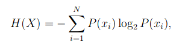

Source: http://tuvalu.santafe.edu/~simon/it.pdf

Entropy
=======

The most important quantity in information theory is entropy.

If all the possible events are `X = x_1, x_2, ..., x_N`, and `x_i` occurs with probability `P(x_i)`, then entropy is

```
H(X) = - P(x_1)*log_2 P(x_1) - P(x_2)*log_2 P(x_2)  ...
     = - \sum{i=1}{N} P(x_i)*log_2(x_i)
     = + \sum{i=1}{N} P(x_i)*log_2(1/x_i)
```

This one is worth memorizing!



Intuition
---------

Look at the definition of `H(X)`.
It's a sum over all possible events, in each term multiplying with the probability of the event.
So it seems like it is calculating the average of something.
The average of what?
Of the value `-log P(x_i) = log (1/P(x_i))`.
It's the number of bits (or symbols from an alphabet of `K` symbols, if we are using `log_K`) we need to represent the inverse probability.
It's the number of bits (or symbols) we would need to be able to differentiate between `1/P(x_i)` values.
So it's a sort of valuation on the information we get from the event occuring: we would need `log(1/P(x_i))` bits to distinguish it from similar events.

But all events may have different probabilities, and different lenghts, so we would hardly need that many bits to decide.
If, for example, we had two events, occuring with likelyhood 0.75 and 0.25, we would only need a single bit to distinguish them.
So `log 1/0.25 = log 4 = 2` is no longer a good measure of information in the second event, is it?
Let's just calculate `H` for this situation:

```
  0.75 * log (1/0.75) + 0.25 * log (1/0.25)
= 3/4 * log (4/3)     + 1/4  * log (4)
= 3/4 * (2 - log (3)) + 1/4  * 2
= 3/4 * (2 - log (3)) + 1/4  * 2
= 3/4 * 2 + 1/4 * 2 - 3/4 * log (3)          (*)
= 2 - 3/4 * log (3)
```

What do we see when we group the terms as on line `(*)`?
Let's imagine that the big event was split in three different events, each with probability 0.25.
Then on line `(*)`, if we express the other event probabilities in terms of the less likely one, what we get is the information in the less likely event as the total, except we need to subtract a term.
This subtraction term grows with the likelyhood of the other event, indicating that if we *coarse-grain* events (group them), the total information in the process goes down.
So every term in the sum has a component (the logarithm) which says how much information would be carried in a process of uniformly random events with that event's probability.
Then there is a form of "control term" that deals with bringing the entropy of the process down when we coarse-grain it.
