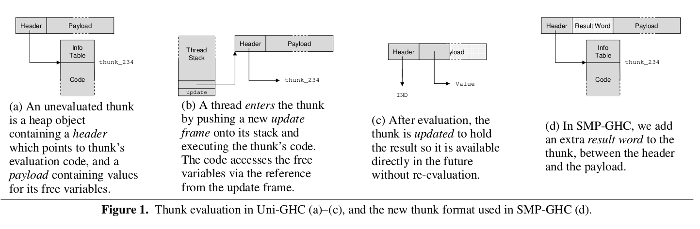

General advice
==============

Look for garbage collection bottlenecks.
If you are not getting speedups, set ridiculous large nursery size, more than you'll need.
Otherwise, a good nursery size should (usually) not be larger than L2 cache (256 Kb per core on intel Haswell).

Coding
======

Low-level: `par` and `pseq`
---------------------------

Import `Control.Parallel` and use `par` to create parallel sparks, and `pseq` to force sequences (don't use `seq`, as the optimizer may do some reordering that ruins your parallelism).

Often becomes messy, with structuring code and sematnic code mixed everywhere.

You can use Strategies to separate concerns.

Mid-level: Strategies
---------------------

High-level: `Par` monad
-----------------------

Compiling and running
=====================

[Using Symmetric Multiprocessor](https://downloads.haskell.org/~ghc/7.0.4/docs/html/users_guide/using-smp.html)

In short:

```sh
ghc -O2                  \ # When running for performance, always optimize.
    --threaded           \ # Allow threading.
    --rtsopts            \ # Enable run-time system flags.
    --eventlog           \ # Enable profiling, ThreadScope uses this log.
    --feager-blackholing \ # See below
    MyHaskellProgram.hs
```

Run with

```sh
./MyHaskellProgram +RTS -N[x] -s
```

where `x` is the number of cores (usually actual cores, not hyperthreads, but do experiment), minus 1 (leave one for the OS).
The `-s` flag gives statistics.
On my Intel Haswell CPU, it would be

```sh
./MyHaskellProgram +RTS -N3 -s
```

In the statistics output, look at `Total time`, which gives total time on all cores and total time elapsed in the real world.

The stats include information about the sparks:
 - `converted` are the ones that were actually useful.
 - `overflowed` means the spark pool overflowed and some sparks were discarded.
 - `GC'd` where just garbage collected, never even touched.
 - `dud` first argument to `rpar` was already evaluated.
 - `fizzled` means the spark was stolen by another processor than the one that created it.

Blackholing
-----------

Paper: "Haskell on a Shared-Memory Multiprocessor."

Blackholing means that when a thread starts evaluating a thunk, it will mark it as in progress.
It's a bit like a lock, except other threads don't have to respect it, it's just a suggestion.
It helps threads avoid doing duplicated work (even though it can happen, if two threads grab the same piece of work at the same time).
The flag `-feager-blackholing` is sensible and usually increases performance.

The tools
=========

ThreadScope
-----------

Under the hood (GHC)
====================

An unevaluated thunk is a a header pointing to relevant data to evaluate a thunk, and bindings for free variables.
When the thunk has been evaluated, the free variables part is replaced by the actual result, and the header uses the `IND` instruction to point into it.
In parallel GHC, there is a result word added between header and free variable bindings so the written result is not accidentally interpreted as part of the free variable bindings by another thread.




Papers:
- "Haskell on a Shared-Memory Multiprocessor" (multiproc05) <http://community.haskell.org/~simonmar/papers/multiproc.pdf> 

Greyholing
----------

Also called eager blackholing.
Means blackholing without obtaining a lock on the header.
This leaves a very short window for two Haskell threads to enter the same thunk and cause duplicated work.
For some reason, this window is only between two instructions, but I don't get why [multiproc05, Sect. 4.4].


